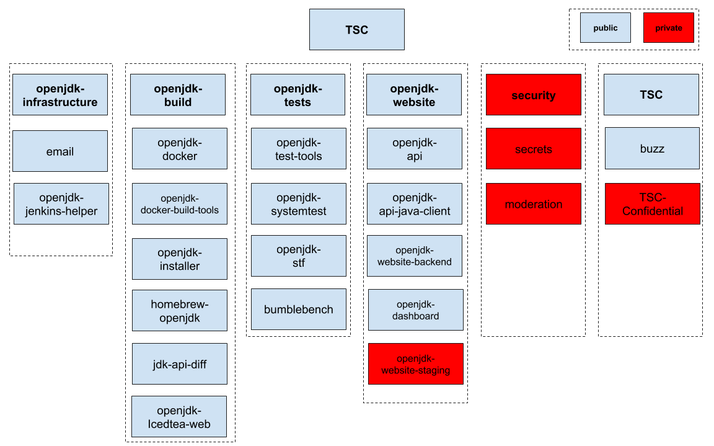
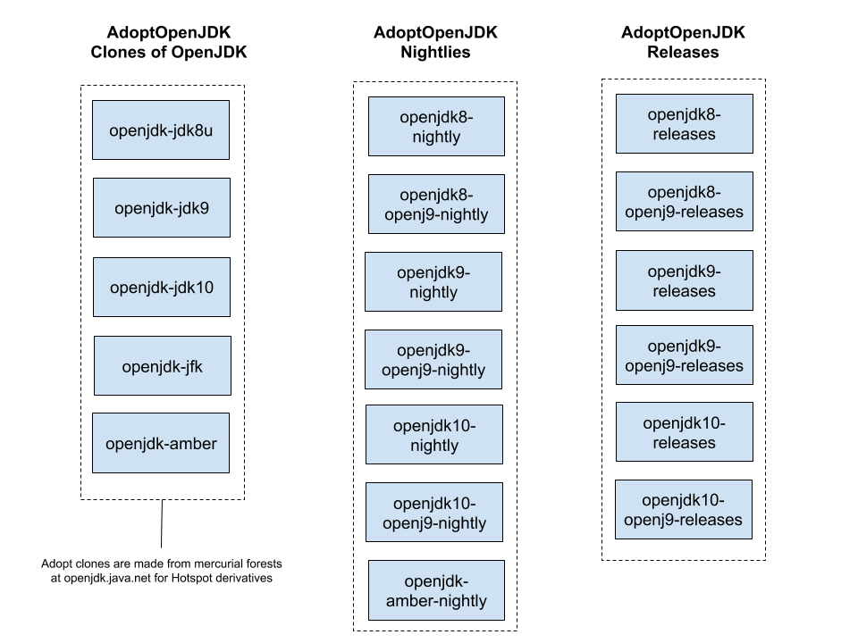
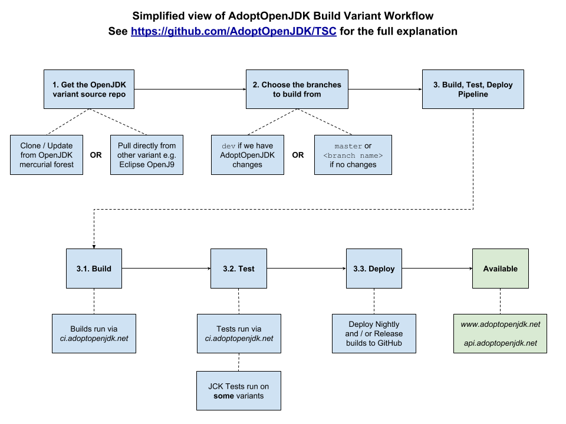

# AdoptOpenJDK TSC and Knowledge Base

## Contribution

We welcome any contributions big or small from experienced OpenJDK folks to those who are brand new to software projects!

To start, make sure you sign up to the [AdoptOpenJDK Slack](https://adoptopenjdk.net/slack.html), say hello and please read
the [Contribution Guide](CONTRIBUTING.md).

# Knowledge Base

## Overview

The AdoptOpenJDK Build Farm is three things:

1. **A Repository of professionally built, tested and supported OpenJDK binaries** - A place for end users to download professionally built and tested OpenJDK binaries, see [Support](https://adoptopenjdk.net/support.html) for our full support details.
1. **A Community of builders** - A place where those who build and test OpenJDK come together to share common code and practices.
1. **Infrastructure as Code** - To host, build, test and deploy variants of [OpenJDK](http://openjdk.java.net) (aka Java)!
This infrastructure as code is designed to be usable by any person or organisation wishing to build a derivative
build farm or parts of one.

See [https://www.adoptopenjdk.net](https://www.adoptopenjdk.net) for in depth details of the motivation, who's involved, the sponsors and much more!

## Dependent Projects
These projects are located in the following repositories in rough order of importance with regards to understanding how
the build farm is put together and works.  Each repository maintains its own set of issues, pull requests and
documentation (edit the [Image Source](https://docs.google.com/drawings/d/1daX4YkvpyHOy0aaA80ECC2vKTjOVIUATKiJM4QOw7hI/edit) at Google and export to make
changes.)

* [Technical Steering Committee (TSC)](https://github.com/AdoptOpenJDK/TSC) - The Technical Steering Committee and Knowledge Base starting point
  * [TSC-confidential)](https://github.com/AdoptOpenJDK/TSC-confidential) - To hold any confidential information for the TSC, e.g. Sponsorship Agreements 
  * [security](https://github.com/AdoptOpenJDK/security) - A private repo for the security team
    * [moderation](https://github.com/AdoptOpenJDK/moderation) - A private repo for moderation requests
    * [openjdk-security](https://github.com/AdoptOpenJDK/openjdk-security) - A private repo for (adopt)openjdk vulnerability investigations
    * [secrets](https://github.com/AdoptOpenJDK/secrets) - A private repo for secrets
  * [buzz](https://github.com/AdoptOpenJDK/buzz) - Community Outreach and Sponsors
* [openjdk-infrastructure](https://github.com/AdoptOpenJDK/openjdk-infrastructure) - Infrastructure as Code and documentation for build farm hosts
    * [email](https://github.com/AdoptOpenJDK/email) - For handling all org emails (mailgun)
    * [openjdk-jenkins-helper](https://github.com/AdoptOpenJDK/openjdk-jenkins-helper) - An auto label generator for Jenkins
* [openjdk-build](https://github.com/AdoptOpenJDK/openjdk-build) - Code and instructions for building Adopt OpenJDK Binaries
    * [openjdk-Icedtea-web](https://github.com/AdoptOpenJDK/openjdk-Icedtea-web) - A mirror of Iced tea web, the OSS replacement for Java Web Start and the Browser plugin.
    * [openjdk-docker](https://github.com/AdoptOpenJDK/openjdk-docker) - Scripts for creating Docker images of OpenJDK binaries
    * [openjdk-docker-build-tools](https://github.com/AdoptOpenJDK/openjdk-docker-build-tools) - Helper scripts for [openjdk-docker](https://github.com/AdoptOpenJDK/openjdk-docker) 
    * [openjdk-installer](https://github.com/AdoptOpenJDK/openjdk-installer) - Installer files for creating platform packaged OpenJDK binaries
    * [homebrew-openjdk](https://github.com/AdoptOpenJDK/homebrew-openjdk) - HomeBrew TAP repo for all macOS OpenJDK binaries
    * [jdk-api-diff](https://github.com/AdoptOpenJDK/jdk-api-diff) - A diff tool that reports what API changes there are between versions
* [openjdk-tests](https://github.com/AdoptOpenJDK/openjdk-tests) - Instructions for all testing at AdoptOpenJDK, code for app, performance and regression testing of AdoptOpenJDK Binaries and CI test automation scripts
    * [openjdk-test-tools](https://github.com/AdoptOpenJDK/openjdk-test-tools) - Tools for openjdk testing (not to be confused with [stf](https://github.com/AdoptOpenJDK/stf) which is the tooling for system tests)
    * [openjdk-systemtest](https://github.com/AdoptOpenJDK/openjdk-systemtest) - Code and instructions for system and load testing AdoptOpenJDK Binaries
    * [stf](https://github.com/AdoptOpenJDK/stf) - The System Test Framework, a harness for executing [openjdk-systemtest](https://github.com/AdoptOpenJDK/openjdk-systemtest)
    * [bumblebench](https://github.com/AdoptOpenJDK/bumblebench) - A microbenchmarking test framework for Adopt OpenJDK
* [openjdk-website](https://github.com/AdoptOpenJDK/openjdk-website) - Code and instructions for https://www.adoptopenjdk.net
    * [openjdk-website-next](https://github.com/AdoptOpenJDK/openjdk-website-next) - The Typescript and React re-write for https://www.adoptopenjdk.net
    * [openjdk-api](https://github.com/AdoptOpenJDK/openjdk-api) - Code and instructions for https://api.adoptopenjdk.net
        * [openjdk-api-java-client](https://github.com/AdoptOpenJDK/openjdk-api-java-client) - A Java client for our API
    * [openjdk-website-backend](https://github.com/AdoptOpenJDK/openjdk-website-backend) - Code for pulling the GitHub releases API into the website
    * [openjdk-dashboard](https://github.com/AdoptOpenJDK/openjdk-dashboard) - AdoptOpenJDK Dashboard for download stats at https://dash.adoptopenjdk.net

### AdoptOpenJDK Source and Distribution Repos

The following diagram lists the source and distro repos for AdoptOpenJDK (edit the
[Image Source](https://docs.google.com/drawings/d/1h2YzP1zAUsYku8sFbx5xP2mTe1DFVx-6NOHzQ3Hso5w/edit) at Google and export to make changes.)

### Clones of OpenJDK Forests

When an OpenJDK variant is mercurial based or AdoptOpenJDK needs to maintain its own patches then we have a clone of that source:

* [openjdk-jdk8u](https://github.com/AdoptOpenJDK/openjdk-jdk8u)
* [openjdk-aarch64-jdk8u](https://github.com/AdoptOpenJDK/openjdk-aarch64-jdk8u)
* [openjdk-jdk9u](https://github.com/AdoptOpenJDK/openjdk-jdk9u)
* [openjdk-jdk10u](https://github.com/AdoptOpenJDK/openjdk-jdk10u)
* [openjdk-jdk11u](https://github.com/AdoptOpenJDK/openjdk-jdk11u)
* [openjdk-jdk12u](https://github.com/AdoptOpenJDK/openjdk-jdk12u)
* [openjdk-jdk13u](https://github.com/AdoptOpenJDK/openjdk-jdk13u)
* [openjdk-jdk](https://github.com/AdoptOpenJDK/openjdk-jdk)
* [openjdk-jfx](https://github.com/AdoptOpenJDK/openjdk-jfx)
* [openjdk-amber](https://github.com/AdoptOpenJDK/openjdk-amber)

### AdoptOpenJDK binary repos

These GitHub Repos are where builds that pass the pipeline are published to. The 
API (and subsequently) website poll these repos to make binaries available.

* [openjdk8-binaries](https://github.com/AdoptOpenJDK/openjdk8-binaries/) - AdoptOpenJDK nightly and release binaries for OpenJDK 8 (HotSpot VM and Eclipse OpenJ9 VM)
* [openjdk9-binaries](https://github.com/AdoptOpenJDK/openjdk9-binaries/) - AdoptOpenJDK nightly and release binaries for OpenJDK 9 (HotSpot VM and Eclipse OpenJ9 VM)
* [openjdk10-binaries](https://github.com/AdoptOpenJDK/openjdk10-binaries/) - AdoptOpenJDK nightly and release binaries for OpenJDK 10 (HotSpot VM and Eclipse OpenJ9 VM)
* [openjdk11-binaries](https://github.com/AdoptOpenJDK/openjdk11-binaries/) - AdoptOpenJDK nightly and release binaries for OpenJDK 11 (HotSpot VM and Eclipse OpenJ9 VM)
* [openjdk12-binaries](https://github.com/AdoptOpenJDK/openjdk12-binaries/) - AdoptOpenJDK nightly and release binaries for OpenJDK 12 (HotSpot VM and Eclipse OpenJ9 VM)
* [openjdk13-binaries](https://github.com/AdoptOpenJDK/openjdk13-binaries/) - AdoptOpenJDK nightly and release binaries for OpenJDK 13 (HotSpot VM and Eclipse OpenJ9 VM)
* [openjdk-binaries](https://github.com/AdoptOpenJDK/openjdk-binaries/) - AdoptOpenJDK nightly and release binaries for OpenJDK (Latest) (HotSpot VM and Eclipse OpenJ9 VM)

### OpenJDK binary repos

These GitHub Repos are where builds from the OpenjDK update projects (led by 
Red Hat) are published to. The API (and subsequently) website poll these repos 
to make binaries available.

* [openjdk8-upstream-binaries](https://github.com/AdoptOpenJDK/openjdk8-upstream-binaries/) - OpenJDK nightly and release binaries for OpenJDK 8 (HotSpot VM)
* [openjdk11-upstream-binaries](https://github.com/AdoptOpenJDK/openjdk11-upstream-binaries/) - OpenJDK nightly and release binaries for OpenJDK 11 (HotSpot VM)

### Private repos

Due to security or licensing concerns the following repos are private.  Please raise an issue on the
 [Infrastructure Project](https://github.com/AdoptOpenJDK/openjdk-infrastructure) if you think you need access.

* [TSC-confidential)](https://github.com/AdoptOpenJDK/TSC-confidential) - To hold any confidential information for the TSC, e.g. Sponsorship Agreements
* [moderation](https://github.com/AdoptOpenJDK/moderation) - For holding moderation requests
* [secrets](https://github.com/AdoptOpenJDK/secrets) - For holding some secrets
* [security](https://github.com/AdoptOpenJDK/security) - For the security team
* [openjdk-security](https://github.com/AdoptOpenJDK/openjdk-security) - A private repo for (adopt)openjdk vulnerability investigations
* [openjdk-website-staging](https://github.com/AdoptOpenJDK/openjdk-staging-webiste) - for staging website PR's

## Workflow

The following diagram is a very simplified view of how a build progresses through a pipeline (edit the
[Image Source](https://docs.google.com/drawings/d/161cqoq0e12nFADSL-bOMeJv4KdwzPRtby8so10msFtg/edit) at Google and export to make changes.)

**NOTE:** Please ensure you read the documentation below and in the appropriate repos to get a full understanding

The workflow to source, build, test and deploy variants of OpenJDK is as follows.

### 1. Get the OpenJDK variant source code

We source variants and versions of OpenJDK from a variety of source repositories.
[Add a new build variant](https://github.com/AdoptOpenJDK/TSC/wiki/Adding-a-new-build-variant) describes the typical work flow of
getting a new variant up and running.  Please also see [Platform Costs](https://github.com/AdoptOpenJDK/TSC/PLATFORM_COSTS.md) as
variants with high impact on the build farm will require funding.

1. **OpenJDK HotSpot Mirrors** - GitHub mirrors of OpenJDK forests are created in the AdoptOpenJDK org. For example:
[openjdk-jdk8u](https://github.com/AdoptOpenJDK/openjdk-jdk8u), [openjdk-jdk11u](https://github.com/AdoptOpenJDK/openjdk-jdk11u). Please open an
[openjdk-TSC issue](https://github.com/AdoptOpenJDK/openjdk-TSC/issues) if you'd like a new variant added.
    1. **git-hg Jobs Update Mirrors** - Our Jenkins CI runs [git-hg jobs](https://ci.adoptopenjdk.net/view/git-hg/) to regularly
        update those various clones of OpenJDK forests. See their job configurations in Jenkins and the [openjdk-build](https://github.com/AdoptOpenJDK/openjdk-build)
        repo for details.
1. **OpenJDK OpenJ9** - Eclipse OpenJ9 source is built from IBM Runtimes, e.g. [openj9-openjdk-jdk8](https://github.com/ibmruntimes/openj9-openjdk-jdk8),
     [openj9-openjdk-jdk9](https://github.com/ibmruntimes/openj9-openjdk-jdk9)
1. **OpenJDK SAP** - SAP source is built from e.g. [openjdk-sap-jdk10](https://github.com/SAP/SapMachine)
1. **OpenJDK OpenJFX** - GitHub mirror of OpenJDK JFX lives at AdoptOpenJDK - [openjdk-jfx](https://github.com/AdoptOpenJDK/openjdk-jfx)

### 2. Choose the branches to build from ###

Each OpenJDK variant has a canonical branch that is built:
1. **OpenJDK HotSpot** - The `dev` branch of AdoptOpenJDK contains extra patches over and above `master` (which is the exact clone of the OpenJDK forest).
`dev` is used to build AdoptOpenJDK binaries
1. **OpenJDK OpenJ9** - Branches such as `openj9-0.8` are used to build OpenJ9 Releases for Java 8 and `openj9` is used to build OpenJ9 for Java 9.
1. **OpenJDK SAP** - The `sapmachine` branch is used to build SAP for Java 10
1. **OpenJDK OpenJFX** - TODO

### 3. Build, Test and Deploy Pipeline

Our Jenkins [Pipelines](https://ci.adoptopenjdk.net/view/Pipelines/) ([source code](https://github.com/AdoptOpenJDK/openjdk-build/tree/master/pipelines)) build
binaries and then push them through a test pipeline (**NOTE** Test pipeline is skipped for certain unstable combinations).

**NOTE:** Once the Test jobs have stabilised, the pipeline described below will change so that only tested binaries are released to
Nightly and Release repos for consumption by the Website and/Or API.  See [The Quality Bar Discussion](https://github.com/AdoptOpenJDK/openjdk-tests/issues/186)
for details.

#### 3.1 Build

[Builds](https://ci.adoptopenjdk.net/) are run on the
[Supported Platforms](https://docs.google.com/spreadsheets/d/1T_sYpMe1y2cSdiP83HA2VWnTH6B-Nbl3ppss0gEpACc/edit?usp=sharing). The Jenkins leader
sends the build jobs to the Jenkins followers based on a tagging system configured in the Jenkins jobs, e.g. `centos6&&x64&&build`. See
[openjdk-build](https://github.com/AdoptOpenJDK/openjdk-build) and [openjdk-infrastructure](https://github.com/AdoptOpenJDK/openjdk-infrastructure) for details.

#### 3.2 Test

Note that other OpenJDK binaries (such as the [openjdk8-upstream-binaries](https://github.com/AdoptOpenJDK/openjdk8-upstream-binaries/) and 
[openjdk11-upstream-binaries](https://github.com/AdoptOpenJDK/openjdk11-upstream-binaries/)) can be put through pipelines 
entering at this Test phase.

[Tests](https://ci.adoptopenjdk.net/view/OpenJDK%20tests/) are run on the
[Supported Test Platforms](https://docs.google.com/spreadsheets/d/1X4CCfvMoCgEavRbvejHrTvPnqj37MB-_C6LB6b8Akkc/edit?usp=sharing). The Jenkins leader
sends the test jobs to the Jenkins followers based on a similar tagging system to build. See [openjdk-tests](https://github.com/AdoptOpenJDK/openjdk-tests) and
[openjdk-infrastructure](https://github.com/AdoptOpenJDK/openjdk-infrastructure) for details.
1. **Builds are tested** - The tests in [openjdk-tests](https://github.com/AdoptOpenJDK/openjdk-tests) are executed and tests results are posted to TODO.
Tests include, but are not limited to the jtreg tests that come with OpenJDK itself.
1. **Builds are system tested** - [System Tests](https://ci.adoptopenjdk.net/view/System%20tests/)
from [openjdk-systemtests](https://github.com/AdoptOpenJDK/openjdk-systemtests) are executed and test results are posted to TODO
1. **Builds are external tested** - [External Tests](https://ci.adoptopenjdk.net/view/Test_external/) are executed and test results are posted to TODO
1. **Builds are performance tested** - [Performance Tests](https://ci.adoptopenjdk.net/view/Test_perf/)
from [bumblebench](https://github.com/AdoptOpenJDK/bumblebench) are executed and test results are posted to TODO

#### 3.3 Deploy Binaries

**TODO**: We're missing the SAP and OpenJFK deployments here.

**NOTE** Future versions of this workflow will show the status of testing and meta data about how the binary was built.

1. **Binaries are deployed** - Using the [OpenJDK Release Tool](https://ci.adoptopenjdk.net/view/Tooling/job/openjdk_release_tool/) (from the
[openjdk-webiste-backend](https://github.com/AdoptOpenJDK/openjdk-website-backend) project) in order to:
    1. deploy them to the various binary repos:
    ([openjdk8-binaries](https://github.com/AdoptOpenJDK/openjdk8-binaries/),
    [openjdk9-binaries](https://github.com/AdoptOpenJDK/openjdk9-binaries/),
    [openjdk10-binaries](https://github.com/AdoptOpenJDK/openjdk10-binaries/),
    [openjdk11-binaries](https://github.com/AdoptOpenJDK/openjdk11-binaries/),
    [openjdk12-binaries](https://github.com/AdoptOpenJDK/openjdk12-binaries/),
    [openjdk13-binaries](https://github.com/AdoptOpenJDK/openjdk13-binaries/),
    [openjdk-binaries](https://github.com/AdoptOpenJDK/openjdk-binaries/)).

1. **Binaries made available** - Binaries are made available for download via the [website](https://www.adoptopenjdk.net)
and [api](https://api.adoptopenjdk.net) gateway. See [openjdk-website](https://github.com/AdoptOpenJDK/openjdk-website),
[openjdk-api](https://github.com/AdoptOpenJDK/openjdk-api) and [openjdk-api-java-client](https://github.com/AdoptOpenJDK/openjdk-api-java-client) projects
for more details.

# The TSC

## List of TSC Responsibilities

The TSC exercises autonomy in setting up and maintaining procedures, policies, and management and administrative structures as it deems appropriate for the maintenance and operation of these projects and resources.

Included in the responsibilities of the TSC are:

-   Managing the tangible assets of the projects such as machines, code, etc, and the intangible assets such as policies, brand, etc for the listed projects and resources
    
-   Meeting monthly to discuss progress and other TSC issues
    
-   Setting and maintaining standards covering contributions of code, documentation and other materials including infrastructure such as build machines
    
-   Facilitating code and binary releases: types, schedules, frequency, delivery mechanisms
    
-   Acquiring resources and ensuring they are maintained in a functional and secure manner for the benefit of the project.
    
-   Resolving overall technical direction for the AdoptOpenJDK organization, including high-level goals and low-level specifics regarding features and functionality
    
-   Maintaining a relationship with the AdoptOpenJDK security group for dealing with vulnerabilities in an appropriate manner
    
-   Setting and maintaining appropriate standards for community discourse via the various mediums under TSC control, including but not limited to the Website, Slack, GitHub comments

## TSC Members

TSC members can nominate new members at any time. Candidates for membership tend to be people who have a competency for community management and high tolerance and patience for process minutiae as the TSC delegates most of its responsibilities to other teams.

### Current Members

| Director | Chair |
|:--:|:--:|
|   [karianna](https://github.com/karianna) - Martijn Verburg (Microsoft) |    [gdams](https://github.com/gdams) - George Adams (Microsoft)  |

| | Members| |
|:--:|:--:|:--:|
|    [cmdc0de](https://github.com/cmdc0de) - Demetrius Comes (GoDaddy) |    [gdams](https://github.com/gdams) - George Adams (Microsoft) |     [hendrikebbers](https://github.com/hendrikebbers) - Hendrik Ebbers (Karakun AG) |
|    [jerboaa](https://github.com/jerboaa) - Severin Gehwolf (Red Hat) |    [johnoliver](https://github.com/johnoliver) - John Oliver (Microsoft) |    [karianna](https://github.com/karianna) - Martijn Verburg (Microsoft) |
|    [smlambert](https://github.com/smlambert) - Shelley Lambert (IBM) |    [sxa555](https://github.com/sxa555) - Stewart X Addison (IBM) |    [tellison](https://github.com/tellison) - Tim Ellison (IBM) |

## Rules for TSC Membership
1.  No single organization can occupy more than half the seats on the TSC.
    
2.  The appointing of TSC members occurs on an annual basis and is based on a do-ocracy.
    
3.  Candidates with the intention of becoming a member of the TSC should briefly outline where they'd like to see the project going - all in a transparent manner that is available to the public.

## Election Process
Each community member has a Single Transferable Vote (STV). There are tools to manage STV voting: https://en.wikipedia.org/wiki/Single_transferable_vote#Voting

Thanks!
The AdoptOpenJDK Community.
